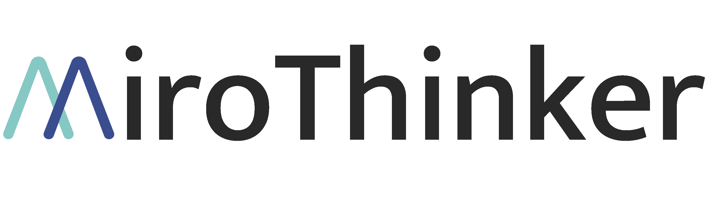

<div align="center">
  
</div>
<!-- <hr> -->
<div align="center">

[](https://dr.miromind.ai/)
[](https://huggingface.co/collections/miromind-ai/mirothinker-v02-68af084a18035f57b17cd902)
[](https://huggingface.co/datasets/miromind-ai/MiroVerse-v0.1)
[](https://miromind.ai/blog/miromind-open-deep-research)

[](https://github.com/MiroMindAI)
[](https://miromind.ai/)
[](https://discord.com/invite/GPqEnkzQZd)
[](huggingface.co/datasets/miromind-ai/MiroFlow-Benchmarks/resolve/main/assets/wechat.png)
[](https://www.xiaohongshu.com/user/profile/5e353bd80000000001000239)

</div>


## 📰 News & Updates

- **[2025-09-11]** 🎉🎉 MiroThinker-72B-Preview ranked 4th in this week’s FutureX benchmark.
- **[2025-09-08]** 🎉 [MiroThinker-v0.2](https://huggingface.co/collections/miromind-ai/mirothinker-v02-68af084a18035f57b17cd902) is now released, achieving open-source SOTA performance across multiple benchmarks. See [here](#-introduction) for more details.
- **[2025-09-04]** Our in-development model, MiroThinker-72B-Preview, ranked 6th in this week’s [FutureX benchmark](https://futurex-ai.github.io/). We will release the stable version of MiroThinker-72B soon.
- **[2025-09-07]** We supported more benchmarks, including [BrowseComp-ZH](https://arxiv.org/abs/2504.19314), [XBench-DeepResearch](https://xbench.org/agi/aisearch), and [FutureX](https://futurex-ai.github.io/). We plan to add more benchmarks in the future.
- **[2025-08-22]** Introducing streamlined deployment options for MiroThinker models with optimized resource usage and faster startup times. Experience the interactive demo: [🚀 Try Gradio Demo](apps/gradio-demo)
- **[2025-08-08]** [MiroThinker-v0.1](https://huggingface.co/collections/miromind-ai/mirothinker-v01-689301b6d0563321862d44a1) released. Models, framework, and data are now fully open-sourced!

## 📝 Introduction

**MiroThinker** is an open-source agentic model series. Designed as a research agent for complex, long-horizon problem solving, it integrates strong capabilities in task decomposition, multi-hop reasoning, retrieval-augmented generation, code execution, web browsing, and document/file processing, enabling a wide range of real-world applications.

**MiroFlow** is a framework for agent development that supports various language models and provides a comprehensive framework for building intelligent agents. The framework includes enhanced conversation management, flexible tool integration, and extensive benchmark evaluations across multiple datasets. 


### MiroThinker-v0.2

In this new version, we introduced three key improvements:

- **Richer training data** from both English and Chinese sources, yielding significant gains in benchmark performance and generalization.
- **Unified DPO training** with a single preference dataset across all models.
- **Extended context length** from 40k to 64k for more challenging multi-turn tool-use tasks.

Compared to v0.1, MiroThinker-v0.2 delivers consistent gains across benchmarks. For example, scores improved from **57.3 → 64.1** on **GAIA-Text-103** and from **17.0 → 29.4** on **BrowseComp-ZH**, reflecting substantial advancements in the model’s general research agent capabilities.

|        Model Name        |      Base Model       | Max Length |                                HF Link                                 |
|:------------------------:|:---------------------:|:----------:|:----------------------------------------------------------------------:|
| MiroThinker-4B-SFT-v0.2  |       Qwen3-4B        |    64K     | [🤗 link](https://huggingface.co/miromind-ai/MiroThinker-4B-SFT-v0.2)  |
| MiroThinker-4B-DPO-v0.2  |       Qwen3-4B        |    64K     | [🤗 link](https://huggingface.co/miromind-ai/MiroThinker-4B-DPO-v0.2)  |
| MiroThinker-8B-SFT-v0.2  |       Qwen3-8B        |    64K     | [🤗 link](https://huggingface.co/miromind-ai/MiroThinker-8B-SFT-v0.2)  |
| MiroThinker-8B-DPO-v0.2  |       Qwen3-8B        |    64K     | [🤗 link](https://huggingface.co/miromind-ai/MiroThinker-8B-DPO-v0.2)  |
| MiroThinker-14B-SFT-v0.2 |       Qwen3-14B       |    64K     | [🤗 link](https://huggingface.co/miromind-ai/MiroThinker-14B-SFT-v0.2) |
| MiroThinker-14B-DPO-v0.2 |       Qwen3-14B       |    64K     | [🤗 link](https://huggingface.co/miromind-ai/MiroThinker-14B-DPO-v0.2) |
| MiroThinker-32B-SFT-v0.2 |       Qwen3-32B       |    64K     | [🤗 link](https://huggingface.co/miromind-ai/MiroThinker-32B-SFT-v0.2) |
| MiroThinker-32B-DPO-v0.2 |       Qwen3-32B       |    64K     | [🤗 link](https://huggingface.co/miromind-ai/MiroThinker-32B-DPO-v0.2) |
| MiroThinker-72B-SFT-v0.2 | Qwen2.5-72B-Instruct  |    64K     |                              Coming Soon                               |
| MiroThinker-72B-DPO-v0.2 | Qwen2.5-72B-Instruct  |    64K     |                              Coming Soon                               |

### MiroThinker-v0.1

<details>
  <summary>Click here to open</summary>
<div align="center">
  
  <p><strong>Performance of Open-Source Models on GAIA-Validation Benchmark.</strong></p>
</div>

We have released the **MiroThinker v0.1** series, including both SFT and DPO variants at parameter scales of **8B**, **14B**, and **32B**. Notably, MiroThinker-v0.1 achieves **state-of-the-art performance** among open-source models on the [GAIA benchmark](https://huggingface.co/datasets/gaia-benchmark/GAIA), a rigorous evaluation suite for advanced agentic capabilities, demonstrating its strength in long-context, decision-intensive, and real-world task scenarios.

| Model Name                | Base Model | Max Length | HF Link                                                               |
| :-----------------------: |:----------:|:----------:| :--------------------------------------------------------------------:|
| MiroThinker-8B-SFT-v0.1   |  Qwen3-8B  |    40K     | [🤗 link](https://huggingface.co/miromind-ai/MiroThinker-8B-SFT-v0.1)  |
| MiroThinker-8B-DPO-v0.1   |  Qwen3-8B  |    40K     | [🤗 link](https://huggingface.co/miromind-ai/MiroThinker-8B-DPO-v0.1)  |
| MiroThinker-14B-SFT-v0.1  | Qwen3-14B  |    40K     | [🤗 link](https://huggingface.co/miromind-ai/MiroThinker-14B-SFT-v0.1) |
| MiroThinker-14B-DPO-v0.1  | Qwen3-14B  |    40K     | [🤗 link](https://huggingface.co/miromind-ai/MiroThinker-14B-DPO-v0.1) |
| MiroThinker-32B-SFT-v0.1  | Qwen3-32B  |    40K     | [🤗 link](https://huggingface.co/miromind-ai/MiroThinker-32B-SFT-v0.1) |
| MiroThinker-32B-DPO-v0.1  | Qwen3-32B  |    40K     | [🤗 link](https://huggingface.co/miromind-ai/MiroThinker-32B-DPO-v0.1) |

</details>

## ✨ Key Features

### 🤖 **MiroThinker-Optimized Framework**

- **Fully Open-Source Agent Framework**: Complete transparency with open framework and open models.
- **Tool Integration**: Seamless integration with external tools and APIs.
- **Trace Collection**: Comprehensive logging and analysis of agent interactions with elapsed time and estimated completion time displayed in minutes. Ready for SFT and DPO.
- **Benchmark Evaluation**: Extensive testing across multiple benchmark datasets.

### 📊 **Comprehensive Benchmark Suite**

- **GAIA Validation**: A benchmark for General AI Assistants. ([paper](https://arxiv.org/abs/2311.12983))
- **GAIA-Text-103**: A subset of GAIA Validation for text-only tasks. ([paper](https://arxiv.org/abs/2505.22648))
- **HLE**: Humanity's Last Exam. ([paper](https://arxiv.org/abs/2501.14249))
- **HLE-Text-500**: A subset of HLE for text-only tasks. ([paper](https://arxiv.org/pdf/2504.21776))
- **BrowseComp-EN**: Web browsing and comprehension tasks. ([paper](https://arxiv.org/abs/2504.12516))
- **BrowseComp-ZH**: A Chinese version of BrowseComp. ([paper](https://arxiv.org/abs/2504.19314))
- **WebWalkerQA**: Web navigation and question answering. ([paper](https://arxiv.org/abs/2501.07572))
- **Frames**: Factuality, Retrieval, And reasoning MEasurement Set. ([paper](https://arxiv.org/abs/2409.12941))
- **XBench-DeepResearch**: A benchmark for deep research agents. ([website](https://xbench.org/agi/aisearch))
- **FutureX**: A live benchmark designed for predicting unknown future. ([website](https://futurex-ai.github.io/))

## 🌐 Online Demo

Welcome to try out our online demo [here](https://dr.miromind.ai/). In this demo, we have deployed our [MiroThinker-32B-DPO-v0.2](https://huggingface.co/miromind-ai/MiroThinker-32B-DPO-v0.2) along with commercial tools to deliver an enhanced user experience.

## 🚀 Quick Start

MiroThinker is trained on our large-scale, high-quality trajectory and preference datasets [MiroVerse](https://huggingface.co/datasets/miromind-ai/MiroVerse-v0.1), utilizing the efficient training framework [MiroTrain](https://github.com/MiroMindAI/MiroTrain), and enhanced with tool-use capabilities through our agentic framework [MiroFlow](https://github.com/MiroMindAI/MiroFlow).

In this repository, we mainly introduce how to deploy a MiroThinker model and conduct benchmark performance evaluations using the MiroFlow framework.

<div align="center">
  
</div>

### Prerequisites

- Python 3.10+
- uv package manager
- Required API keys

### Installation

#### 1. **Clone the Repository**

```bash
git clone https://github.com/MiroMindAI/MiroThinker
cd MiroThinker
```

#### 2. **Download Benchmark Data**

```bash
wget https://huggingface.co/datasets/miromind-ai/MiroFlow-Benchmarks/resolve/main/data_20250911_password_protected.zip
unzip data_20250911_password_protected.zip
# The unzip passcode is: `pf4*`.
rm data_20250911_password_protected.zip
```

#### 3. **Setup Environment**

```bash
# Shift working dir
cd apps/miroflow-agent
# Install environment
uv sync
# Create .env file with your API keys
cp .env.example .env
# Edit .env with your actual API keys
```

We currently support two tool configurations for benchmark testing:
1. Using the default settings of open-source tools as much as possible. ([config](apps/miroflow-agent/conf/agent/evaluation_os.yaml))
2. Using advanced settings of commercial tools. ([config](apps/miroflow-agent/conf/agent/evaluation.yaml))
   
The tool lists for these two settings are shown in the table below:

|         Tool Set          |                         Default Setting <br>with Open-Source Tools                          |                        Advanced Setting <br>with Commercial Tools                        |
|:-------------------------:|:-------------------------------------------------------------------------------------------:|:----------------------------------------------------------------------------------------:|
|       Google Search       |                                [Serper](https://serper.dev/)                                |                              [Serper](https://serper.dev/)                               |
|       Linux Sandbox       |                                   [E2B](https://e2b.dev/)                                   |                                 [E2B](https://e2b.dev/)                                  |
|    Audio Transcription    |       [Whisper-Large-v3-Turbo](https://huggingface.co/openai/whisper-large-v3-turbo)        | [GPT-4o mini Transcribe](https://platform.openai.com/docs/models/gpt-4o-mini-transcribe) |
| Visual Question Answering |       [Qwen2.5-VL-72B-Instruct](https://huggingface.co/Qwen/Qwen2.5-VL-72B-Instruct)        |   [Claude Sonnet 3.7](https://docs.anthropic.com/en/docs/about-claude/models/overview)   |
|         Reasoning         | [Qwen3-235B-A22B-Thinking-2507](https://huggingface.co/Qwen/Qwen3-235B-A22B-Thinking-2507)  |   [Claude Sonnet 3.7](https://docs.anthropic.com/en/docs/about-claude/models/overview)   |

Configure the following variables in your `.env` file according to the mode you choose:

```python
# API for Google Search (recommended)
SERPER_API_KEY=your_serper_key
SERPER_BASE_URL="https://google.serper.dev"

# API for Web Scraping (recommended)
JINA_API_KEY=your_jina_key
JINA_BASE_URL="https://r.jina.ai"

# API for Linux Sandbox (recommended)
E2B_API_KEY=your_e2b_key
```

<details> 
<summary>Optional API keys (click to open)</summary>
  
```python
# API for LLM-as-Judge (for benchmark testing, optional)
OPENAI_API_KEY=your_openai_key

# API for Open-Source Audio Transcription Tool (for benchmark testing, optional)
WHISPER_MODEL_NAME="openai/whisper-large-v3-turbo"
WHISPER_API_KEY=your_whisper_key
WHISPER_BASE_URL="https://your_whisper_base_url/v1"

# API for Open-Source VQA Tool (for benchmark testing, optional)
VISION_MODEL_NAME="Qwen/Qwen2.5-VL-72B-Instruct"
VISION_API_KEY=your_vision_key
VISION_BASE_URL="https://your_vision_base_url/v1/chat/completions"

# API for Open-Source Reasoning Tool (for benchmark testing, optional)
REASONING_MODEL_NAME="Qwen/Qwen3-235B-A22B-Thinking-2507"
REASONING_API_KEY=your_reasoning_key
REASONING_BASE_URL="https://your_reasoning_base_url/v1/chat/completions"

# API for Claude Sonnet 3.7 as Commercial Tools (optional)
ANTHROPIC_API_KEY=your_anthropic_key

# API for Sougou Search (optional)
TENCENTCLOUD_SECRET_ID=your_tencent_cloud_secret_id
TENCENTCLOUD_SECRET_KEY=your_tencent_cloud_secret_key
```

</details>

### Serve the MiroThinker Model

#### Option 1 (Recommended): Serve with SGLang

Use SGLang to serve MiroThinker models at port 61002:

```
NUM_GPUS=4
PORT=61002

# Downloading model from HF
MODEL_PATH=miromind-ai/MiroThinker-32B-DPO-v0.2

python3 -m sglang.launch_server \
    --model-path $MODEL_PATH \
    --tp $NUM_GPUS \
    --dp 1 \
    --host 0.0.0.0 \
    --port $PORT \
    --trust-remote-code \
    --chat-template assets/qwen3_nonthinking.jinja
```

This will start a server at: `http://0.0.0.0:$PORT$`. Use this as your server base URL.

#### Option 2: Quantized Light-Weight Options

We also provide comprehensive guidance for serving MiroThinker models using CPU-optimized and GPU-accelerated quantization techniques, along with detailed analysis and guidelines for deployment with llama.cpp, Ollama, SGLang, and other inference frameworks. A complete guide can be found at [Deployment Documentation](apps/gradio-demo/)

### Basic Usage

#### 1. **Run a single evaluation**

```bash
cd apps/miroflow-agent
uv run main.py llm=qwen3-32b agent=evaluation llm.openai_base_url=https://your_base_url/v1
```

#### 2. **Run comprehensive benchmark evaluation**

- If you want to use open-source tools, set <code>AGENT_SET="evaluation_os"</code> (default).
- If you want to use commercial tools, set <code>AGENT_SET="evaluation"</code>.<br>

```bash
# GAIA-Val-165
LLM_MODEL="xxx" BASE_URL="xxx" bash scripts/run_evaluate_multiple_runs_gaia-validation.sh
# Other benchmarks follow the same pattern.
```

<details>
  <summary>Show all benchmark commands</summary>
  
```bash
# GAIA-Text-103
LLM_MODEL="xxx" BASE_URL="xxx" bash scripts/run_evaluate_multiple_runs_gaia-validation-text-103.sh

# WebWalkerQA
LLM_MODEL="xxx" BASE_URL="xxx" bash scripts/run_evaluate_multiple_runs_webwalkerqa.sh

# HLE
LLM_MODEL="xxx" BASE_URL="xxx" bash scripts/run_evaluate_multiple_runs_hle.sh

# HLE-Text-500
LLM_MODEL="xxx" BASE_URL="xxx" bash scripts/run_evaluate_multiple_runs_hle-text-500.sh

# FRAMES
LLM_MODEL="xxx" BASE_URL="xxx" bash scripts/run_evaluate_multiple_runs_frames.sh

# BrowseComp-EN
LLM_MODEL="xxx" BASE_URL="xxx" bash scripts/run_evaluate_multiple_runs_browsecomp.sh

# BrowseComp-ZH
LLM_MODEL="xxx" BASE_URL="xxx" bash scripts/run_evaluate_multiple_runs_browsecomp_zh.sh

# XBench-DeepResearch
LLM_MODEL="xxx" BASE_URL="xxx" bash scripts/run_evaluate_multiple_runs_xbench_deepresearch.sh

# FutureX
LLM_MODEL="xxx" BASE_URL="xxx" bash scripts/run_evaluate_multiple_runs_futurex.sh
```

</details>

#### 3. **Monitor evaluation progress**

```bash
# For GAIA-Validation
python benchmarks/check_progress/check_progress_gaia-validation.py /path/to/evaluation/logs

# For GAIA-Text-103
python benchmarks/check_progress/check_progress_gaia-validation-text-103.py /path/to/evaluation/logs

# Others follow the same pattern
```

## 🛠️ Using Open-Source Tools

We provide the option to use open-source tools as alternatives to commercial tools. 
One way to access these open-source tools is to purchase them from API providers, such as [SiliconFlow](https://www.siliconflow.com/).

Of course, these tools can also be deployed on local servers.
For detailed setup and local deployment instructions, please refer to our documentation: [USE-OS-TOOL.md](assets/USE-OS-TOOL.md).

## 📈 Benchmark Performance

> [!IMPORTANT]
> <div>
> To prevent data leakage during searches, we block Hugging Face domains to ensure the model doesn't access answers through shortcuts.
> For the detailed implementation, see
> <a href="https://github.com/MiroMindAI/mirage/blob/MiroFlow-MiroThinker/libs/miroflow-tools/src/miroflow_tools/manager.py#L277">here</a>.
> </div>

> [!WARNING]
> To reduce evaluation costs, starting from September 10 we replaced the tool for scraping websites from [Serper](https://serper.dev/) to [Jina](https://jina.ai/). This may cause a slight decrease in benchmark scores for MiroThinker v0.1 and v0.2 models. If you wish to better reproduce the previously reported performance, please switch to the v0.2 branch.

### MiroThinker-v0.2

#### Comparison with SOTA Research Agents

<div>
  
</div>

#### GAIA Benchmark

<div>
  
</div>

### MiroThinker-v0.1

<details>
  <summary>Click here to open</summary>

#### GAIA Benchmark

| **Method** | Text-103<br>Best Pass@1 | Text-103<br>Pass@1 (Avg@8) | Val-165<br>Best Pass@1 | Val-165<br>Pass@1 (Avg@8) |
| ----------------------------------------------------------------- | :--: | :--: | :--: | :--: |
| **🔹—— 7B/8B Models ——** | | | | |
| Search-o1-7B                                                      | 17.5 | -    | -    | -    |
| R1-Searcher-7B                                                    | 20.4 | -    | -    | -    |
| WebDancer-7B                                                      | 31.0 | -    | -    | -    |
| WebSailor-7B                                                      | 37.9 | -    | -    | -    |
| CK-Pro-8B                                                         | 40.3 | -    | 32.7 | -    |
| **MiroThinker-8B-SFT-v0.1**                                           | 44.7 | 40.1 | 34.6 | 31.8 |
|     + Commercial Tools                        | 46.6 | 42.1 | 37.6 | 33.9 |
| **MiroThinker-8B-DPO-v0.1**                                           | 46.6 | 44.8 | 37.0 | 35.4 |
|     + Commercial Tools                        | **50.5** | **46.7** | **38.2** | **35.9** |
| **🔹—— 14B Models ——** | | | | |
| **MiroThinker-14B-SFT-v0.1**                                          | 47.6 | 44.4 | 37.0 | 34.4 |
|     + Commercial Tools                        | 49.5 | 47.5 | 41.8 | 39.8 |
| **MiroThinker-14B-DPO-v0.1**                                          | 48.5 | 46.6 | 42.4 | 39.2 |
|     + Commercial Tools                        | **52.4** | **48.5** | **45.5** | **42.0** |
| **🔹—— 32B Models ——** | | | | |
| Qwen3-32B                                                         | 31.1 | 26.7 | 29.7 | 26.4 |
| Search-o1-32B                                                     | 28.2 | -    | -    | -    |
| WebThinker-32B-RL                                                 | 48.5 | -    | -    | -    |
| WebDancer-QwQ-32B                                                 | 51.5 | -    | -    | -    |
| WebSailor-32B                                                     | 53.2 | -    | -    | -    |
| WebShaper-QwQ-32B                                                 | 53.3 | -    | -    | -    |
| **MiroThinker-32B-SFT-v0.1**                                      | 55.3 | 51.3 | 44.9 | 42.7 |
|     + Commercial Tools                                            | 58.3 | 54.2 | 48.5 | 45.8 |
| **MiroThinker-32B-DPO-v0.1**                                      | 57.3 | 54.1 | 48.5 | 45.9 |
|     + Commercial Tools                                            | **60.2** | **57.9** | **50.9** | **48.9** |

1. Following the practices of WebThinker, WebAgents, and CognitiveKernel, we report the Best Pass@1, the highest score across three runs, which often reflects stronger performance, though it may exhibit some variability. To provide a more stable measure, we additionally report Pass@1 (Avg@8), which offers greater consistency at the cost of slightly lower scores.

2. For consistency with prior open-source works, we evaluate GAIA-Text-103 using the WebAgents LLM-as-judge template, and report results on GAIA-Val-165 using the official GAIA scorer script.

3. By default, we use open-source tools wherever possible, except for the code tool [E2B](https://github.com/e2b-dev/E2B) and the Google search tool [Serper](https://serper.dev/). We use [Whisper](https://huggingface.co/openai/whisper-large-v3-turbo), [Qwen2.5-VL-72B-Instruct](https://huggingface.co/Qwen/Qwen2.5-VL-72B-Instruct), and [Qwen3-235B-A22B-Thinking-2507](https://huggingface.co/Qwen/Qwen3-235B-A22B-Thinking-2507) in our implementation. The framework can be easily extended to other open-source tools of your choice.

4. Replacing these open-source tools with commercial alternatives can yield performance gains. Commercial tools were mainly used for multimodal capabilities and certain complex reasoning subtasks. The majority of tasks, including planning, browsing, refinement, navigation, and more, were handled by our models.

#### More Benchmarks

| Method                       | HLE<br>Pass@1 | Frames<br>Pass@1 | BrowseComp<br>Pass@1 | BrowseComp-ZH<br>Pass@1 | WebWalkerQA<br>Pass@1 |
|------------------------------|:-------------:|:----------------:|:--------------------:|:-----------------------:|:---------------------:|
| OpenAI Deep Research         |     26.6      |        -         |         51.5         |          42.9           |           -           |
| Gemini Deep Research         |     26.9      |        -         |          -           |            -            |           -           |
| Kimi-Researcher              |     26.9      |       78.8       |          -           |            -            |           -           |
|                              |               |                  |                      |                         |                       |
| WebDancer-7B                 |       -       |        -         |          -           |            -            |         36.0          |
| WebSailor-7B                 |       -       |        -         |         6.7          |          14.2           |           -           |
| **MiroThinker-8B-SFT-v0.1**  |       -       |       58.0       |         5.5          |           9.3           |         41.3          |
| **MiroThinker-8B-DPO-v0.1**  |       -       |       64.4       |         8.7          |          13.6           |         45.7          |
|                              |               |                  |                      |                         |                       |
| WebThinker-32B-RL            |       -       |        -         |          -           |            -            |         46.5          |
| WebDancer-QwQ-32B            |       -       |        -         |         3.8          |          18.0           |         47.9          |
| WebSailor-32B                |       -       |        -         |         10.5         |          25.5           |           -           |
| WebShaper-32B                |       -       |        -         |          -           |            -            |         51.4          |
| **MiroThinker-32B-SFT-v0.1** |     10.2      |       70.4       |         10.6         |          13.8           |         45.7          |
| **MiroThinker-32B-DPO-v0.1** |     11.8      |       71.7       |         13.0         |          17.0           |         49.3          |

1. MiroThinker’s performance was tested with this repository and open-source tools; other models’ results are from their papers and official sites.

2. As [MiroVerse-v0.1](https://huggingface.co/datasets/miromind-ai/MiroVerse-v0.1) mainly contains English data, the model’s Chinese capability is limited. We plan to add more Chinese data to improve performance in the next version.

</details>

## 📊 Trace Collection

The trace collection scripts automatically save logs in the `logs/` directory in `chatml` format.

```bash
cd apps/collect-trace

# Collect Traces for SFT
bash scripts/run_benchmark_claude.sh

# Collect Traces for DPO
bash scripts/run_benchmark_qwen.sh
```

## 📄 License

This project is licensed under the Apache License 2.0 - see the [LICENSE](LICENSE) file for details.

## 🙏 Acknowledgments

- **Benchmark Contributors** for the comprehensive evaluation datasets
- **Open Source Community** for the tools and libraries that make this possible

## 📞 Support

- **Issues**: For questions or bug reports, please use [GitHub Issues](https://github.com/MiroMindAI/MiroThinker/issues).
- **QA Documentation**: See [QA.md](assets/QA.md) for additional guidelines

### References

```
@misc{2025mirothinker,
    title={MiroThinker: An open-source agentic model series trained for deep research and complex, long-horizon problem solving},
    author={MiroMind AI Team},
    howpublished={\url{https://github.com/MiroMindAI/MiroThinker}},
    year={2025}
}
```

[](https://star-history.com/#MiroMindAI/MiroThinker&Date)
